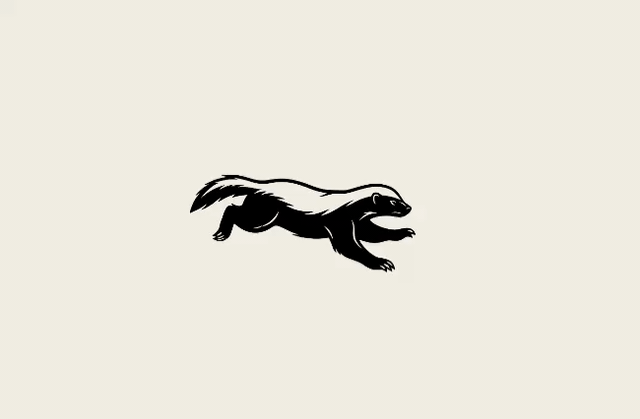

# Honey Badger Loader

A lightweight, zero-dependency React sprite animation component. One WebP file, one DOM element, zero React renders per frame.

**[Live demo →](https://brunoaccorsi.github.io/honey-badger/)**



## Stats

| | |
|---|---|
| Asset | `sprite.svg` — 95 KB, infinitely scalable |
| HTTP requests | 1 |
| Dependencies | React only (already in your project) |
| DOM nodes | 1 `<div>` |
| React renders after mount | 0 (animation is fully imperative) |

---

## Adding it to your project

### Step 1 — Copy the files

Copy these two things into your project:

```
your-project/
├── public/
│   └── frames/
│       └── sprite.webp        ← copy here
└── src/
    └── components/
        └── HoneyBadgerLoader.tsx  ← copy here
```

### Step 2 — Fix the sprite import path

Open `HoneyBadgerLoader.tsx` and update the import at the top to match your setup.

**Vite** (recommended — bundles and hashes the asset automatically):
```ts
import spriteSrc from "../../../public/frames/sprite.webp";
```

**Next.js** — replace the import with a plain string pointing to `public/`:
```ts
// delete the import line, add this constant instead:
const spriteSrc = "/frames/sprite.webp";
```

**Create React App** — same as Vite, import works out of the box:
```ts
import spriteSrc from "./frames/sprite.webp";
// (put sprite.webp next to the component, not in public/)
```

### Step 3 — Use it

```tsx
import HoneyBadgerLoader from "./components/HoneyBadgerLoader";

export default function MyPage() {
  return (
    <div>
      <HoneyBadgerLoader />
    </div>
  );
}
```

---

## Props

| Prop | Type | Default | Description |
|---|---|---|---|
| `size` | `number` | `220` | Width in px. Height scales automatically at the native 590:282 ratio. |
| `fps` | `number` | `18` | Frames per second. Try 12 for casual, 24 for frantic. |
| `paused` | `boolean` | `false` | Freeze on the current frame. |
| `className` | `string` | — | CSS class on the wrapper element. |
| `style` | `React.CSSProperties` | — | Inline styles on the wrapper element. |

---

## Examples

```tsx
// Default
<HoneyBadgerLoader />

// Bigger and faster
<HoneyBadgerLoader size={320} fps={24} />

// Pause when done loading
<HoneyBadgerLoader paused={isDone} />

// Fit to a container with CSS
<HoneyBadgerLoader size={160} style={{ opacity: 0.85 }} />
```

---

## Common patterns

### Show during async operations

```tsx
function DataLoader() {
  const [loading, setLoading] = useState(true);

  useEffect(() => {
    fetchData().finally(() => setLoading(false));
  }, []);

  if (loading) return <HoneyBadgerLoader size={200} />;
  return <MyContent />;
}
```

### Full-screen overlay

```tsx
function LoadingOverlay({ visible }: { visible: boolean }) {
  if (!visible) return null;
  return (
    <div style={{
      position: "fixed", inset: 0,
      display: "flex", alignItems: "center", justifyContent: "center",
      background: "rgba(244, 240, 232, 0.92)",
      zIndex: 9999,
    }}>
      <HoneyBadgerLoader size={260} />
    </div>
  );
}
```

### Next.js App Router — mark as a client component

```tsx
"use client";
import HoneyBadgerLoader from "@/components/HoneyBadgerLoader";
```

---

## How it works

The animation loop runs entirely outside React. After the initial render, a `requestAnimationFrame` loop mutates `el.style.backgroundPosition` directly — no `setState`, no reconciliation, no virtual DOM diffing per frame.

`fps` is stored in a ref so you can change it at runtime without restarting the loop. `prefers-reduced-motion` is respected automatically — users who request reduced motion see a static frame.

The sprite sheet is a vector SVG (4 columns × 3 rows, 12 frames total), sharp at any display size. At the default 220 px size it scales to about 880×334 px in the background.
